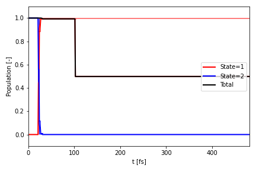
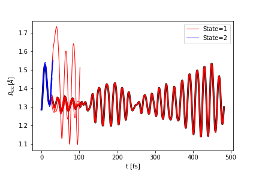
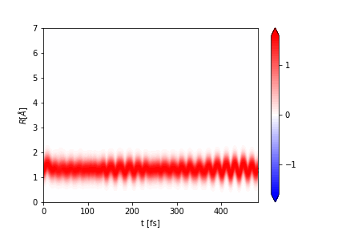
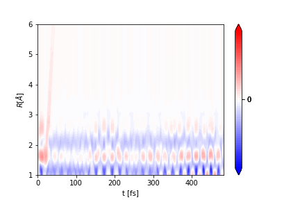

# Getting Started with aimsprop

## What is aimsprop?

This package was developed to analyse data from AIMS simulations. The functionality revolves around a Bundle object which properties can be calculated on, for example geometric properties, time dependent spectra, population decay etc. The Bundle object consists of a list of Frame objects, which contain the properties.

The documentation for the package can be found [here](https://mtzgroup.github.io/aimsprop/).

## Creating a Bundle object from an AIMS run

First, make sure that you have the package installed:
`pip install aimsprop`

Then you can import the package into your file:

```python
import aimsprop as ai
```

The documentation for creating and manipulating bundle objects can be
found [here](https://mtzgroup.github.io/aimsprop/code_reference/bundle.py/).

You can read in an AIMS simulation from and FMS90 run. As an example, we will read in the data used for testing, so we set `aims_dir = "tests/test_data/"` and we set `IC = "0002"`. These should be changed to the path to your AIMS output.

First, to create a Path object to the AIMS data (this is better than using a simple string since it manages file/dir paths well).

```python
from pathlib import Path

aims_path = Path(aims_dir)
```

We can then pass the Path object into aimsprop:

```python
bundle = ai.parse_fms90(aims_path / IC, scheme='mulliken')
```

We can also read in a collection AIMS runs from different initial conditions. We can set `ICs = ["0002","0003"]`:

```python
bundles = [ai.parse_fms90(aims_path / IC, scheme='mulliken') for IC in ICs]
```

Here, the variable bundles is a list of Bundle objects which can be merged together to form the AIMS simulation, containing the
data for all the specified initial conditions. The weights of each bundle are specified, which can be set
according to the IC oscillator strength or the ICs can be weighted evenly as below:

```python
simulation = ai.Bundle.merge(bundles, ws=[1.0 / len(bundles)] * len(bundles), labels=ICs)
```

If you have terminated your TBFs on the ground state and run adiabatic extensions, you can pass the xyz files
from
these using `ai.parse_xyz`. The time should be set to when the ground state TBF begins and then this can be
merged into `simulation` for the IC it is associated with using the `ai.Bundle.merge` function as above.

### Cleaning the simulation

FMS90 AIMS simulations include adaptive time steps in regions of high non-adiabatic coupling. It is often useful to
remove these adaptive timesteps and have evenly spaced time steps for your Bundle object. First we can define the
times that we want our Bundle frames to be, e.g. `ts = np.arange(0.0, max(simulation.ts), 40.0)`.

```python
simulation = simulation.interpolate_linear(ts)
```

We can also remove duplicates incase any exist, e.g. from AIMS restarts:

```python
simulation = simulation.remove_duplicates()
```

### Using the Bundle object

As noted previously, the Bundle object consists of a list of Frame objects. Therefore you can iterate through the
frames and print or extract frame properties:

```python
for frame in simulation.frames:
    label = frame.label
    time = frame.t
    weight = frame.w
    state = frame.I
    widths = frame.widths
```

You can also extract the list of properties for the entire Bundle `simulation` using, for example:

```python
labels = simulation.labels
times = simulation.ts
weights = simulation.ws
states = simulation.Is
```

You can select only a portion of the total `simulation` using the `subset_by_<>` functions:

```python
simulation_s0 = simulation.subset_by_I(1)
simulation_500au = simulation.subset_by_t(500)
```

## Computing geometric properties

The geometric properties that are supported are:

- Bond length
- Bond angle
- Torsion angle
- Out of plane angle
- Proton transfer coordinate.

The documentation for the geometric functions can be
found [here](https://mtzgroup.github.io/aimsprop/code_reference/geom.py/).

### Bond length

You can calculate the bond length between two atoms, e.g atom indices `0` and `1` and name the property, e.g. "R01":

```python
ai.compute_bond(simulation, "R01", 0, 1)
```

### Bond angle

You can calculate the bond angle between three atoms, e.g atom indices `0`, `1` and `2` name the property, e.g. "A012":

```python
ai.compute_angle(simulation, "A012", 0, 1, 2)
```

### Torsion angle

You can calculate the torsion angle between four atoms, e.g atom indices `0`, `1`, `2` and `3` and name the property,
e.g. "
T0123":

```python
ai.compute_torsion(simulation, "T0123", 0, 1, 2, 3)
```

You can also unwrap properties so that it continues beyond 180 degrees rather than jumping back down to -180:

```python
ai.unwrap_property(simulation, "T0123", 360.0)
```

### Transfer coordinate

You can calculate the transfer coordinate between atoms, e.g atom indices `0`, `1`, and `2` and name the property,
e.g. "PT012":

```python
ai.compute_transfer_coord(simulation, "PT012", 0, 1, 2)
```

### Extracting properties

Once a property has been added to the Bundle object, it can be extracted with its key id:

```python
r01 = simulation.extract_property("R01")
```

## Calculate Population

Documentation for the population can be found [here](https://mtzgroup.github.io/aimsprop/code_reference/pop.py/).

If you want to calculate the population use

```python
pop = ai.compute_population(simulation)
```

If you just want to plot the population to a file, e.g. `P.png`, you can instead run:

```python
ai.plot_population(
    "P.png",
    simulation,
    bundles,
    time_units="fs",
    state_colors=["r", "b"],
)
```

where `simulation` is the merged Bundle object, and `bundles` is the list of parsed Bundle objects. The file can also
be saved as a PDF or PNG.



## Plotting properties

Documentation for the plotting functions can be
found [here](https://mtzgroup.github.io/aimsprop/code_reference/plot.py/).\
You can plot scalar properties and blurred properties. The files can be written as PNG or PDF files.

### Plot scalar properties

You can plot the properties that you calculated above, for example plotting the bond angle:

```python
ai.plot_scalar("R.png",
               simulation,
               "R01",
               ylabel=r"$R_{CC} [\AA{}]$",
               time_units="fs",
               state_colors=["r", "b"],
               clf=False,
               plot_average=True,
               )
```

The figure is saved to the file `R.png`. The function returns the plt object so it can be modified as needed.


### Plot vector properties

The documentation for applying a Gaussian to a property
is [here](https://mtzgroup.github.io/aimsprop/code_reference/blur.py/).

In order to blur a property using a Gaussian convolution, first create a space over which the property can be blurred,
and then computer the blurred property:

```python
R = np.linspace(0, 7, 100)
ai.blur_property(simulation, "R01", "R01blur", R, alpha=8.0)
```

The blurred property is written with key, `"R01blur"`.

To plot a blurred property use:

```python
ai.plot_vector(
    "Rblur.png",
    simulation,
    "R01blur",
    y=R,
    ylabel=r"$R [\AA{}]$",
    time_units="fs",
    nlevel=64
)
```



The figure is saved to the file `Rblur.png`. The function returns the plt object, so it can be modified as needed.

The same can be done for the other properties.

## Time dependent spectra

Currently, ultrafast electron diffraction and ultrafast x-ray scattering signals can be computed with aimsprop.\
There is more information on these techniques [here](https://pubs.acs.org/doi/png/10.1021/acs.jctc.8b01051).

### Ultrafast electron diffraction

The Ultrafast electron diffraction (UED) signal can be generated by defining a bond length range and then computing the
signal:

```python
R = np.linspace(1.0, 6.0, 50)
ai.compute_ued_simple(simulation, "UED", R=R, alpha=8.0)
```

Notes on how the UED signal is computed can be
found [here](https://github.com/mtzgroup/aimsprop/blob/feature-tutorial-doc/notes/ued/report.png).

You can then plot the signal:

```python
ai.plot_vector(
    "UED.png",
    simulation,
    "UED",
    y=R,
    ylabel=r"$R [\AA{}]$",
    time_units="fs",
    diff=True
)
```



The figure will be saved in `UED.png`.

## Reading and Writing Bundle objects

You can use pickle to write/read in the Bundle object so you dont have to re-generate it again each
time.

First, load pickle:

```python
import pickle
```

Writing the Bundle object `simulation` to a file:

```python
with open("simulation.out", "wb") as f:
    pickle.dump(simulation, f)
```

Reading it back from a file:

```python
with open("simulation.out", "rb") as f:
    simulation = pickle.load(f)
```

When the Bundle object is written to a file, all of its properties are also written. Therefore when it is
read from a pickle file, it contains all information that was stored in it, including its properties.

### Writing xyz files

The documentation for xyz files can be found [here](https://mtzgroup.github.io/aimsprop/code_reference/xyz.py/). You can
parse xyz files into aimsprop to build a Bundle object. You can also write them:

```python
ai.write_xyzs(simulation, ".")
```
